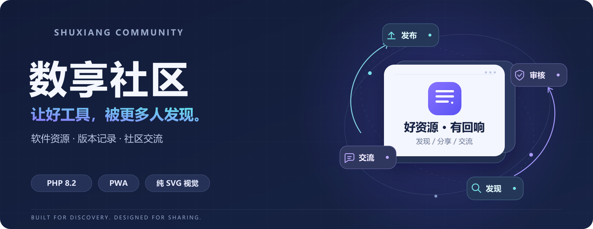
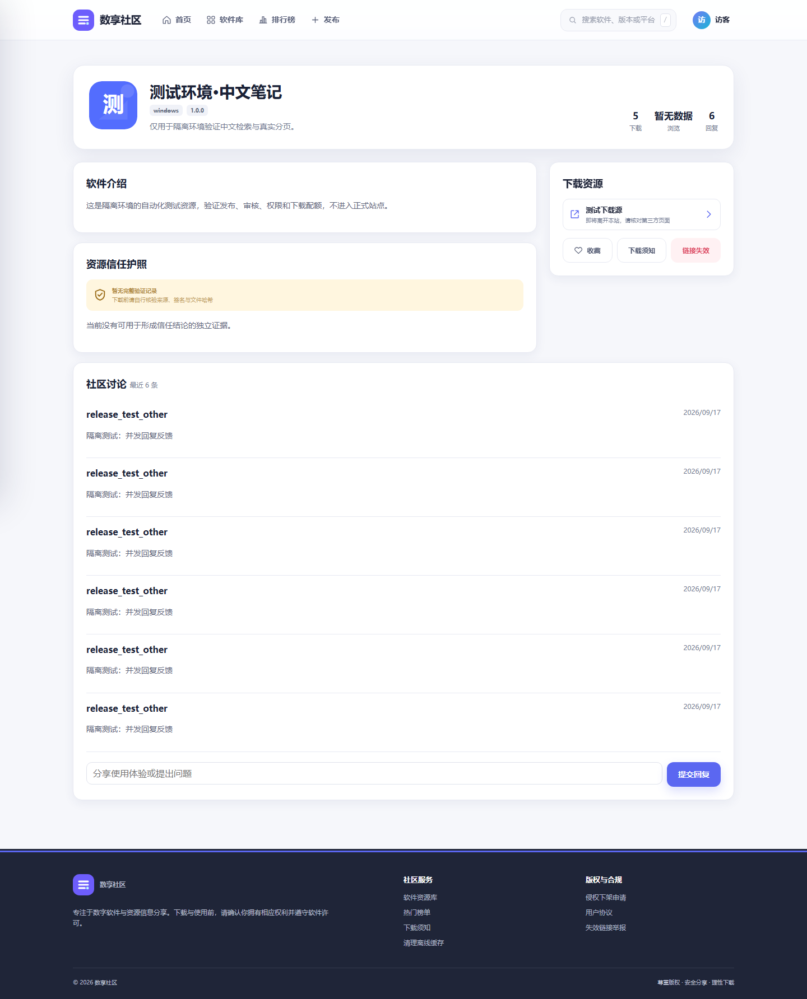
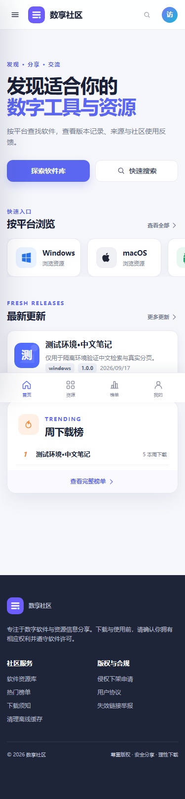
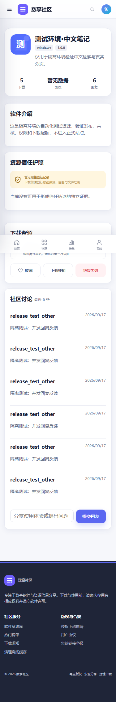
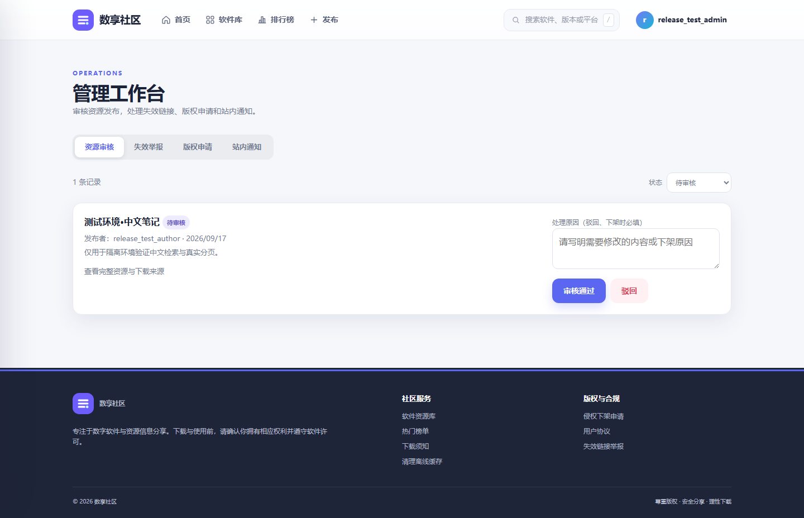
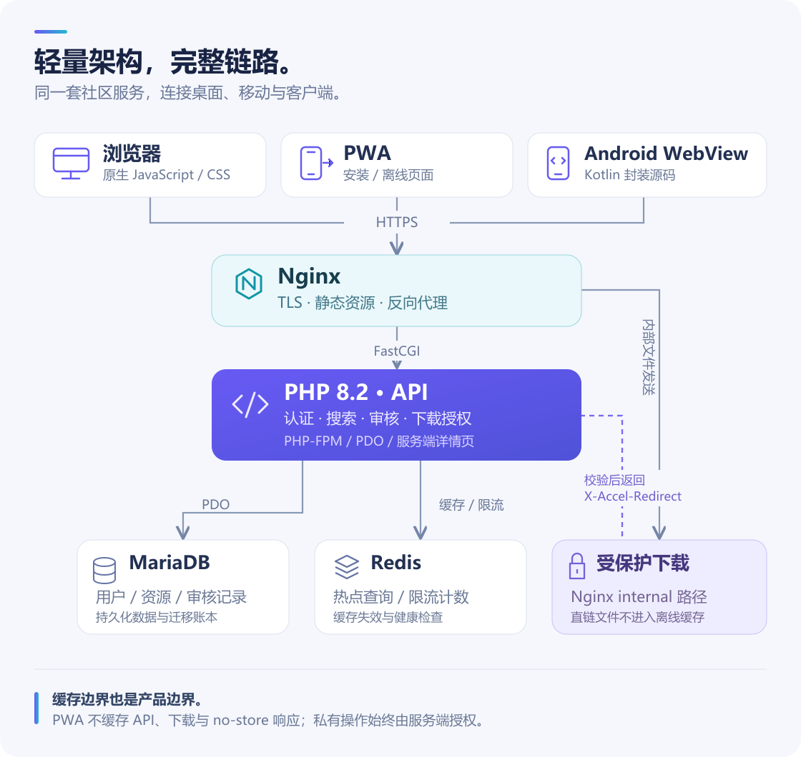

<p align="center">
  <a href="README.md">简体中文</a> · <strong>English</strong>
</p>

<p align="center">
  
</p>

<div align="center">

# Shuxiang Community · 数享社区

**A home for software releases, useful discussions, and moderated sharing.**

A self-hosted resource community built with plain PHP and JavaScript, with responsive pages, PWA support, and an Android WebView client.

[](https://github.com/Waffing/shuxiang-community/actions/workflows/ci.yml)

<kbd>PHP 8.2</kbd> &nbsp; <kbd>MariaDB 10.11</kbd> &nbsp; <kbd>Redis 7</kbd> &nbsp; <kbd>Vanilla JS</kbd> &nbsp; <kbd>PWA</kbd> &nbsp; <kbd>Kotlin</kbd>

[Preview](#preview) · [Features](#features) · [Deploy](#deploy) · [Architecture](#architecture-and-development) · [Changelog](CHANGELOG.md) · [Latest release](https://github.com/Waffing/shuxiang-community/releases/latest)

</div>

| Explore the site | Host your own | Contribute |
| :--- | :--- | :--- |
| [Open Shuxiang →](https://2.bhsq.top/) | [Deployment guide →](docs/GETTING_STARTED.md) | [Contribution guide →](CONTRIBUTING.md) |
| Browse the interface and community features | Docker, existing Nginx, or local preview | Report a reproducible issue or open a focused PR |

The application interface and detailed operator guides are currently in Chinese. This README covers the project and the standalone deployment path in English.

## Preview

These screenshots use an **isolated demo environment**. Sample resources, accounts, and downloads illustrate the interface.



<details>
<summary><strong>Mobile preview — home and resource details</strong></summary>

<table>
  <tr>
    <th width="50%">Home</th>
    <th width="50%">Resource details</th>
  </tr>
  <tr>
    <td align="center"></td>
    <td align="center"></td>
  </tr>
</table>

</details>

<details>
<summary><strong>Moderation preview — submissions and reports</strong></summary>



The workspace lives at `/#/admin`. The server checks the administrator role for every management operation.

</details>

## Features

| Area | Available today |
| :--- | :--- |
| **Discovery** | Chinese keyword search; combined platform, category, date, popularity, and access filters; real pagination and weekly download rankings |
| **Software releases** | Windows, macOS, Android, iOS, and Linux tags; versions, changelogs, multiple download sources, checksums, and archive passwords |
| **Community** | Accounts, favorites, replies, daily check-ins, points, author submissions, and a personal dashboard |
| **Moderation** | Submission review, review after author edits, decision history, one-time first-approval rewards, dead-link reports, and copyright requests |
| **Access control** | Reply / points / VIP unlock rules, daily download quotas, expiring download tokens, Cookie / Bearer authentication, and session revocation after password changes |
| **Devices** | Mobile filter drawer, keyboard focus handling, PWA offline pages, and Kotlin WebView source |
| **Operations** | Server-rendered resource details, SEO metadata, Redis caching, database migrations, Docker Compose, HTTPS, and scheduled backups |

**The visual assets are part of the source.** SVG and CSS draw interface icons, platform marks, empty states, and fallback avatars. Missing resource icons use the name's initial and category color; uploaded images are processed into WebP.

Trust indicators use structured verification records. Checksums establish file identity. The service worker excludes API, download, and `no-store` responses from its offline cache.

## Deploy

Use this path on a **new, dedicated Linux Docker environment**. Install Docker Engine, the Compose plugin, Git, and OpenSSL. Point your domain to the server and make ports 80/443 available and reachable.

```bash
git clone https://github.com/Waffing/shuxiang-community.git
cd shuxiang-community
cp .env.example .env

read -r -p 'Site domain: ' DOMAIN
read -r -p 'Certificate email: ' CERTBOT_EMAIL
DOMAIN="$DOMAIN" CERTBOT_EMAIL="$CERTBOT_EMAIL" bash deploy.sh

curl -fsS "https://${DOMAIN}/health.php"
```

The script generates random secrets, initializes or migrates the database, builds services, and requests an HTTPS certificate. It backs up an existing database before proceeding. A healthy response includes `status: "ok"`, `database: true`, and `redis: true`.

A fresh installation has no default administrator and no demo resources. Register your own account, then follow the [administrator setup steps](docs/GETTING_STARTED.md#初始化管理员) in the Chinese guide.

For BaoTa, an existing host Nginx, or local HTTP preview, use the [matching deployment path](docs/GETTING_STARTED.md). The standalone commands above assume control of ports 80/443.

<details>
<summary><strong>Page and API entry points</strong></summary>

| Page | Path | Page | Path |
| :--- | :--- | :--- | :--- |
| Home | `/#/home` | Search | `/#/search` |
| Rankings | `/#/rankings` | Publish | `/#/publish` |
| Account | `/#/account` | Moderation | `/#/admin` |
| Crawlable details | `/software/{slug}` | Health | `/health.php` |

See the [API reference](docs/DEVELOPMENT.md#常用-api) for actions and authentication.

</details>

## Architecture and development



| Work on | Start here |
| :--- | :--- |
| Pages, interactions, icons, PWA | [`app/public/`](app/public/) |
| Resources, accounts, downloads, moderation | [`app/src/`](app/src/) |
| Schema and incremental migrations | [`app/database/`](app/database/) |
| Nginx, PHP, containers | [`infra/`](infra/) · [`deploy.sh`](deploy.sh) |
| Android WebView | [`android/`](android/) |

PHP-FPM serves application requests. Node.js is used for asset builds and tests. After frontend changes, run `npm ci --ignore-scripts` and `npm run build`, keeping minified files, Brotli output, page asset versions, and worker cache versions in sync. The [development guide](docs/DEVELOPMENT.md) contains the full workflow.

[GitHub Actions](https://github.com/Waffing/shuxiang-community/actions/workflows/ci.yml) runs asset builds, PHP image and extension checks, permission and cache regressions, and deployment / migration checks. Database, HTTP, upload, and browser tests are also available; see the [test instructions](docs/DEVELOPMENT.md#验证) for their setup requirements.

## Release status and roadmap

Source releases use the [MIT License](LICENSE). See [Releases](https://github.com/Waffing/shuxiang-community/releases) and the [changelog](CHANGELOG.md) for version history. Android is currently a source project: **no signed release APK is published**. FCP, LCP, and frame-rate targets still need measurements on the intended devices and networks.

- [ ] Email verification and account recovery.
- [ ] Monitoring, off-site backups, and restore drills.
- [ ] Device performance baselines, Android signing, and on-device upload / download checks.
- [ ] Search, moderation, and accessibility improvements informed by actual use.

## Contribute

Start with a reproducible bug or a concrete use case. Read the [contribution guide](CONTRIBUTING.md), use the [issue forms](https://github.com/Waffing/shuxiang-community/issues/new/choose), and keep each PR focused. Report vulnerabilities privately through the [security policy](SECURITY.md).

The MIT license covers repository code and original visual assets. Dependencies are listed in [third-party notices](THIRD_PARTY_NOTICES.md). Third-party software, trademarks, and user uploads require their own permissions.
